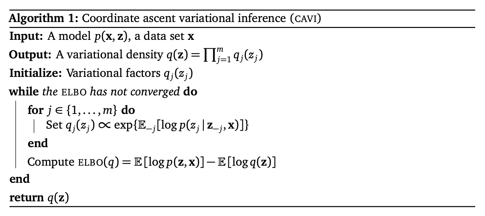

# 变分推断

::: tip
这一节里有的公式似乎没有区分积分和求和，那就不区分了吧反正意思对了就行 2333。
:::

在 [EM 算法中](/ai/dl/pcg/parameters-learning-latent/#从-kl-散度来理解)有：

$$
\log p(x) = \text{ELBO}(q,x) + \text{KL}(q(z) \| p(z | x)) \tag{1}
$$

在 E 步中，我们需要找到一个 $q(z) = p(z | x)$，从而使得 $\log p(x) = \text{ELBO}(q,x)$。这里假设 $p(z | x)$ 是可以计算的，但这个假设有可能是不成立的，后验可能是 intractable 的。

---
这里解释一下为啥 intractable。由贝叶斯定理：

$$
p(z|x) = \frac{p(x|z)p(z)}{p(x)}
$$

也就是说这里需要算输入数据的分布 $p(x)$：

$$
p(x)=\int_z p(x|z)p(z) dz
$$

而在很多情况下这是没法算的（不然还要 GAN 这种调参调到死的玩意儿干啥）。

---

因此有了**变分推断（Variational Inference）**，也称**变分贝叶斯（Variational Bayesian）**，变分推断可以看作 EM 算法的扩展版，主要处理不能精确求出 $p(z|x)$ 的情况。

变分推断的思想是，在 E 步中，寻找一个简单分布 $q^\ast(z)$ 来近似 $p(z|x)$：

$$
q^\ast(z) = \arg \min_{q(z) \in Q} \text{KL}(q(z) \| p(z | x)) \tag{2}
$$

其中 $Q$ 为候选的概率分布族。当 $\text{KL}(q(z) \| p(z | x))$ 无限接近于 0 时，$q^\ast(z)$ 与 $p(z | x)$ 就无限接近。但如刚刚所说，$p(z|x)$ 难以直接计算，因此我们不能直接优化这个 KL 散度。

结合式 (1) 和式 (2)，有：

$$
\begin{aligned}
    q^\ast(z) &= \arg \min_{q(z) \in Q} (\log p(x) - \text{ELBO}(q,x)) \\
        &= \arg \max_{q(z) \in Q} \text{ELBO}(q,x)
\end{aligned}
$$

所以**最小化 KL 散度被转化为了最大化 ELBO**。这里 ELBO 是一个以函数 $q$ 为自变量的函数，即泛函。

这里的公式都没有写参数 $\theta$，因为变分推断中的参数都是随机变量，可以直接算进隐变量 $z$ 里。

## ELBO

[上一节](/ai/dl/pcg/parameters-learning-latent/#从-kl-散度来理解)中算出 $\text{KL}(q(z) \| p(z | x))$ 为：

$$
\begin{aligned}
    \text{KL}(q(z) \| p(z | x)) &= - \sum_z q(z) \log \frac{p(z | x)}{q(z)} \\
        &= \mathbb{E}_{q(z)}[\log q(z)] - \mathbb{E}_{q(z)}[\log p(z|x)] \\
        &= \mathbb{E}_{q(z)}[\log q(z)] - \mathbb{E}_{q(z)}[\log \frac{p(x,z)}{p(x)}] \\
        &= \mathbb{E}_{q(z)}[\log q(z)] - \mathbb{E}_{q(z)}[\log p(x,z)] + \log p(x)
\end{aligned}
$$

则 ELBO 为：

$$
\begin{aligned}
    \text{ELBO}(q,x) &= \log p(x) - \text{KL}(q(z) \| p(z | x)) \\
        &= \mathbb{E}_{q(z)}[\log p(x,z)] - \mathbb{E}_{q(z)}[\log q(z)]
\end{aligned}
$$

而 [EM 算法](/ai/dl/pcg/parameters-learning-latent/#em-算法)中：

$$
\begin{aligned}
    \theta_{t+1} &= \arg \max_\theta \sum_z p_{\theta_t}(z | x) \log p_\theta(x,z) \\
        &= \arg \max_\theta \mathbb{E}_{p_{\theta_t}(z|x)}[\log p_\theta(x,z)]
\end{aligned}
$$

可以看到变分推断中的 ELBO 相比 EM 算法中的 ELBO 大概多了 $- \mathbb{E}_{q(z)}[\log q(z)]$ 这一项。这是因为 EM 算法中 $q(z)$ 是常数项，而在变分推断中并不是。

btw，$- \mathbb{E}_{q(z)}[\log q(z)]$ 就是 $q(z)$ 的熵，可以表示为 $H[q(z)]$。

## 平均场分布族

候选分布族 $Q$ 的复杂性决定了优化问题的复杂性。我们选 $Q$ 的时候可以选我们知道到的、简单的、最好是独立同分布的概率分布。通常会选**平均场（mean-field）分布族**，即 $z$ 可以分拆为多组相互独立的变量，概率密度 $q(z)$ 可以分解为：

$$
q(z) = \prod_{m=1}^M q_m(z_m)
$$

其中 $z_m$ 是隐变量的子集，可以是单变量，也可以是一组多元变量。

那么 $\text{ELBO}(q,x)$ 可以写为：

$$
\begin{aligned}
    \text{ELBO}(q,x) &= \int q(z) \log \frac{p(x,z)}{q(z)} dz \\
        &= \int q(z) (\log p(x,z) - \log q(z)) dz \\
        &= \underbrace{\int \prod_{m=1}^M q_m(z_m) \log p(x,z) dz}_{\text{part1}} - \underbrace{\int \prod_{m=1}^M q_m(z_m) \sum_{m=1}^M \log q_m(z_m) dz}_{\text{part2}} \\
\end{aligned}
$$

对于 part1：

$$
\text{part1} = \int_{z_1} \dots \int_{z_M} \prod_{m=1}^M q_m(z_m) \log p(x,z) dz_1 \dots dz_M
$$

如果只对隐变量的某个子集 $z_j$ 感兴趣：

$$
\begin{aligned}
    \text{part1} &= \int q_j(z_j) \left ( \int \dots \int_{z_{m \ne j}} \prod_{m \ne j}^M q_m(z_m) \log p(x,z) \prod_{m \ne j}^M dz_m \right ) dz_j \\
        &= \int q_j(z_j) \left ( \int \dots \int_{z_{m \ne j}} \log p(x,z) \prod_{m \ne j}^M q_m(z_m) dz_m \right ) dz_j \\
        &= \int q_j(z_j) \left ( \int \prod_{m \ne j}^M q_m(z_m) \log p(x,z) dz_m \right ) dz_j
\end{aligned}
$$

再令：

$$
\log \overline{p}(x, z_j) = \int \prod_{m \ne j} q_m(z_m) \log p(x,z) dz_m \tag{3}
$$

$\overline{p}(x, z_j)$ 可以看作一个关于 $z_j$ 的未归一化的分布。

最终有：

$$
\text{part1} = \int q_j(z_j) \log \overline{p}(x, z_j) dz_j
$$

对于 part2：

$$
\begin{aligned}
    \text{part2} &= \int_{z_1} \dots \int_{z_M} \prod_{m=1}^M q_m(z_m) \sum_{m=1}^M \log q_m(z_m) dz_1 \dots dz_M \\
        &= \int_{z_1} \dots \int_{z_M} [\log q_1(z_1) + \dots \log q_M(z_M)] (q_1(z_1) \dots q_M(z_M)) dz_1 \dots dz_M \\
        &= \int_{z_1} q_1(z_1) \log q_1(z_1) dz_1 + \dots + \int_{z_M} q_M(z_M) \log q_M(z_M) dz_M \\
        &= \sum_{m=1}^M \left( \int_{z_m} q_m(z_m) \log q_m(z_m) dz_m \right )
\end{aligned}
$$

同样，如果只对隐变量的某个子集 $z_j$ 感兴趣：

$$
\text{part2} = \int q_j(z_j) \log q_j(z_j) dz_j + \text{const}
$$

其中，const 为一个常数，即所有与 $q_j(z_j)$ 无关的项。

现在 $\text{ELBO}(q,x)$ 可以写为：

$$
\begin{aligned}
    \text{ELBO}(q,x) &= \text{part1} - \text{part2}\\
        &= \int q_j(z_j) \log \overline{p}(x, z_j) dz_j - \int q_j(z_j) \log q_j(z_j) dz_j + \text{const} \\
        &= \int q_j(z_j) \log \frac{\overline{p}(x, z_j)}{q_j(z_j)} dz_j + \text{const} \\[1em]
        & \rarr - \text{KL} (q_j(z_j) \| \overline{p}(x, z_j)) + \text{const}
\end{aligned}
$$

## 坐标上升法

也就是说，如果我们固定除了 $z_j$ 以外的其他隐变量 $z_{-j}$ 不变，那么 ELBO 可以被看做一个负 KL 散度加上一个常数。因此最小化 KL 散度 $\text{KL} (q_j(z_j) \| \overline{p}(x, z_j))$ 就等于最大化 ELBO。

因此最优的 $q_j^*(z_j)$ 正比于对数联合概率密度 $\log p(x,z)$ 的期望的指数（由式 (3) 推出）：

$$
q_j^*(z_j) = \overline{p}(x, z_j) \propto \exp(\mathbb{E}_{q_{-j}}[\log p(x,z)])
$$

可以用**坐标上升法（Coordinate Ascent Variational Inference，CAVI）**来迭代优化每个 $q_j^*(z_j)$（同时会假设其他隐变量固定不变）。坐标上升法流程为：

## 其他

我们通常会选择一些比较简单的分布 $q(z)$ 来近似 $p(z|x)$。但当 $p(z|x)$ 比较复杂时，往往很难用简单的 $q(z)$ 去近似。这时可以用神经网络的强大拟合能力来近似 $p(z|x)$，这种思想被应用在了[变分自编码器中](/ai/dl/generative-models/vae/)。

## 参考

- [Variational Inference 变分推断](https://www.jianshu.com/p/76e0ad0d8778)
- [Variational Inference: A Review for Statisticians.](https://arxiv.org/pdf/1601.00670.pdf) *David M. Blei, et al.* arXiv 2016.