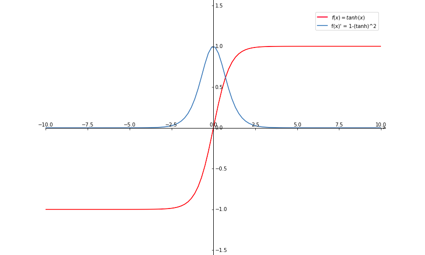
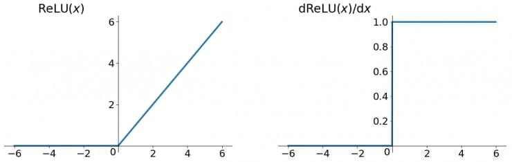

# 激活函数

为了增强网络的表示能力和学习能力，**激活函数**（activation function）需要具备以下性质：

- 连续且可导（允许少数点上不可导）的非线性函数

    - 可导的激活函数可以直接利用数值优化的方法来学习网络参数
    - 使用线性激活函数或不使用激活函数都跟标准逻辑回归没有区别，无论神经网络有多少层，输出都是输入的线性组合

- 激活函数及其导函数要尽量简单，以提高网络计算效率
- 激活函数的导函数的值域要在一个合适的区间内，否则会影响训练的效率和稳定性

## Sigmoid

sigmoid 函数及其导函数公式：

$$
\sigma (x) = \frac{1}{1 + e^{-x}}
$$

$$
\sigma' (x) = - \frac{- e^{-x}}{(1 + e^{-x})^2} = - \frac{1 - (1 + e^{-x})}{(1 + e^{-x})^2} = \frac{1}{1 + e^{-x}} (1 - \frac{1}{1 + e^{-x}}) = \sigma (x) (1 - \sigma (x))
$$

函数图像：

sigmoid 激活函数会把一个实数域的值压入 $(0,1)$ 的范围内。但可以看到 sigmoid 函数在其大部分定义域内的导数的梯度（即函数的斜率）都趋近于 0，导致梯度下降的速度变慢。

## Tanh

tanh 函数及其导函数公式（[求导过程](https://blog.csdn.net/qq_35200479/article/details/84502844)）：

$$
\text{tanh}(x) = \frac{e^z - e^{-z}}{e^z + e^{-z}}
$$

$$
\text{tanh}' (x) = 1 - \text{tanh}(x)^2
$$

函数图像：

tanh（Hyperbolic Tangent，双曲正切）函数可以被看做是向下平移和放大后的 sigmoid 函数，值域是 $(-1,1)$。它的输出是**零中心化**（zero-centered）的，所以它的效果一般都会优于 sigmoid 函数。因为 sigmoid 函数的输出恒大于 0，非零中心化的输出会使得后一层神经元的输入发生**偏置偏移**（bias shift)，从而使得梯度下降的收敛速度变慢。

但 tanh 跟 sigmoid 一样都存在大部分定义域内的导数梯度都趋近于 0 的问题。

## ReLU

ReLU（Rectified Linear Unit，修正线性单元）函数及其导函数公式：

$$
\text{ReLU}(x) = \max (0, x) =

\begin{cases}
   x &x \ge 0 \\
   0 &x < 0
\end{cases}
$$

$$
\text{ReLU}' (x) = 

\begin{cases}
   1 &x \ge 0 \\
   0 &x < 0
\end{cases}
$$

函数图像：

ReLU 函数在 $x > 0$ 时导数为 1，在一定程度上缓解了梯度消失问题，加速了梯度下降的收敛速度。

缺点：

- 输出是非零中心化的，会给后一层的神经网络引入偏置偏移，影响梯度下降的效率

- **死亡 ReLU 问题（dying ReLU problem）**：如果梯度太大或学习率太大，可能会在反向传播的时候让偏置 $b$ 被更新成一个很小的负数，从而导致对于接下来所有的训练样本，神经元的净激活值都小于 0（[解释](https://liam.page/2018/11/30/vanishing-gradient-of-ReLU-due-to-unusual-input/)）。而当输入小于 0 时，ReLU 函数的梯度一直为 0，导致该神经元的参数永远无法更新（[解释](https://www.zhihu.com/question/67151971)）。

    - [cs231n](https://cs231n.github.io/neural-networks-1/#actfun) 上说有 40% 的概率死掉
    - [这里](https://www.quora.com/What-is-the-dying-ReLU-problem-in-neural-networks)似乎说还能复活...

## Leaky ReLU

Leaky ReLU（带泄露的 ReLU）在输入 $x < 0$ 时，保持了一个很小的梯度 $\gamma$，这样保证了有一个非零的梯度可以更新参数：

$$
\text{Leaky ReLU}(x) = \max (0, x) + \gamma \min (0, x) =

\begin{cases}
   x &x \ge 0 \\
   \gamma x &x < 0
\end{cases}
$$

$$
\text{Leaky ReLU}'(x) = 

\begin{cases}
   1 &x \ge 0 \\
   \gamma &x < 0
\end{cases}
$$

其中 $\gamma$ 是一个很小的常数，如 0.01。