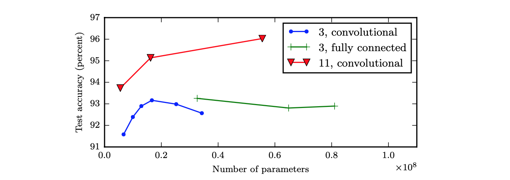

# 深层神经网络

一般来说，有比较多的隐藏层的神经网络会比较好用。

## 更强的特征表示能力

深层结构的一个优点是可以增加特征的重用性，从而指数级地增加表示能力。

比如，对于人脸识别，神经网络的第一层从原始图片中提取人脸的轮廓和边缘，每个神经元学习到不同边缘的信息；第二层将第一层学得的边缘信息组合起来，形成人脸的一些局部的特征，例如眼睛、嘴巴等；后面的几层逐步将上一层的特征组合起来，形成人脸的模样。随着神经网络层数的增加，特征也从原来的边缘逐步扩展为人脸的整体，由整体到局部，由简单到复杂。层数越多，模型学习的效果也就越精确。

对于语音识别，第一层神经网络可以学习到语言发音的一些音调，后面更深层次的网络可以检测到基本的音素，再到单词信息，再到短语、句子等。

通过这些例子可以看到，随着神经网络的深度加深，模型能学习到更加复杂的问题，功能也更加强大。

## 减少参数数量

虽然通用近似定理说明了，只要一个单隐层前馈网络的神经元足够多，它就能够表示任何函数，但这个网络可能大得不可能实现。因此，使用更深的模型能够减少表示期望函数所需的神经元数量。

一个直觉上的例子是，比如想要计算 $$x_1 \text{ XOR } x_2 \text{ XOR } x_3 \text{ XOR } \dots x_n$$（$$x_i \in \{ 0, 1 \}$$），如果按照上图左边这样用多层网络来计算，一共需要 $$\log(n)$$ 层，需要的神经元数量不会很多。

但如果只能用一个隐藏层（上图右边），那么就需要枚举所有 $$2^n$$ 种可能的情况，即这个隐藏层需要 $$2^n$$ 个神经元。所需的神经元数量会呈指数级增长。

## 更容易泛化到测试集

论文 [[1]](#goodfellow-2014) 中的实验表明，增加卷积网络层中参数的数量，但不增加它们的深度，在提升测试集性能方面几乎没有效果：

同时还可以看到，浅层网络（蓝色线）在参数数量达到 2000 万时就过拟合，而深层网络（红色线）在参数数量超过 6000 万时仍然表现良好。这表明了我们想要学习到的函数应该是许多更简单的函数的复合。

## 引用

1. [Multi-digit Number Recognition from Street View Imagery using Deep Convolutional Neural Networks](https://arxiv.org/pdf/1312.6082.pdf). *Ian J. Goodfellow, et al.* ICLR 2014. 