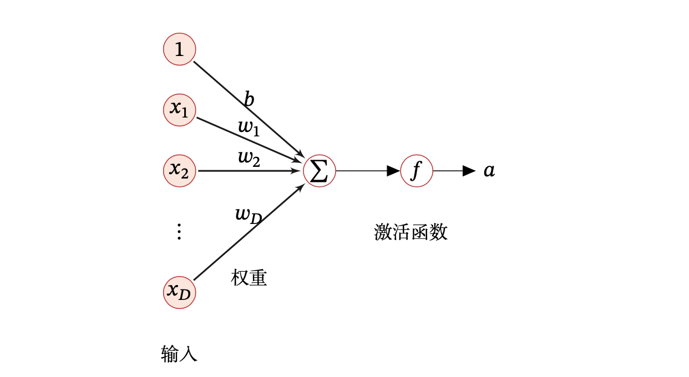

# 网络结构

## 神经元

神经网络的基本单元是**人工神经元（artificial neuron）**，**简称神经元（neuron）**。假设一个神经元接收 $D$ 个输入 $x = [x_1, x_2, \dots, x_D]$，那么该神经元输出值的计算分为两步：

1. 通过一个线性变化得到**净激活值（net activation）**$z \in \Reals$，即该神经元所获得的输入 $x$ 的加权和：

  $$
  z = \sum_{d=1}^D w_d x_d + b = w^{\top}x + b
  $$

  其中，$w = [w_1, w_2, \dots, w_D] \in \Reals^D$ 是 $D$ 维的权重向量，$b \in \Reals$ 是偏置。

2. 净激活值 $z$ 在经过一个**非线性函数** $f(\cdot)$（**[激活函数，activation function](/ai/dl/fnn/activation-function/)**）后，得到**激活值（activation）**$a$：

  $$
  a = f(z)
  $$

## 神经网络

通过一定的连接方式或信息传递方式进行协作的神经元就是**神经网络（neural network）**。常见的网络结构有：

- **前馈网络**：每一层中的神经元接收前一层神经元的输出，并输出到下一层神经元，整个网络中的信息朝一个方向传播，在模型的输出和模型本身之间没有反馈（feedback）连接。

  - 前馈神经网络（Feedforward Neural Network，FNN）
  - 卷积神经网络（Convolutional Neural Networ，CNN）

- **记忆网络**：神经元不但可以接收其他神经元的信息，也可以接收自己的历史信息。神经元具有记忆功能，在不同的时刻具有不同的状态。信息传播可以是单向或双向传递。

  - 循环神经网络（Recurrent Neural Network，RNN）
  - 玻尔兹曼机（Boltzmann Machine，BM）
  - 受限玻尔兹曼机（Restricted Boltzmann Machine，RBM）

- **图网络**：定义在图结构数据上的神经网络，图中每个节点都由一个或一组神经元构成。节点之间的连接可以是有向或无向的，每个节点可以接收来自相邻节点或自身的信息。

图中圆形节点表示一个神经元，方形节点表示一组神经元。

## 前馈神经网络

**前馈神经网络**（Feedforward Neural Network，FNN）可以看做是由多层的逻辑回归模型（连续的非线性函数）组成。每一层的神经元可以接收前一层神经元的信号，并产生信号输出到下一层。第 0 层称为输入层，最后一层称为输出层，其他中间层称为隐藏层。整个网络中无反馈，信号从输入层单向传播到输出层：

一些符号表示为：

- $M_l$：第 $l$ 层神经元个数
- $f_l (\cdot)$：第 $l$ 层的激活函数
- $a^{(l)} \in \Reals^{M_l}$：第 $l$ 层的输出（激活值），$a^{(l)}_i$ 为第 $l$ 层第 $i$ 个神经元的输出
- $z^{(l)} \in \Reals^{M_l}$：第 $l$ 层的净激活值
- $b^{(l)} \in \Reals^{M_l}$：第 $l$ 层的偏置
- $w^{(l)} \in \Reals^{M_l \times M_{l-1}}$：第 $l$ 层的权重矩阵

这里用了**向量化**（vectorization）操作，把 for 循环变成矩阵运算，从而充分利用并行性以提高计算速度。

$a^{(0)} = x$，每层的计算公式为：

$$
z^{(l)} = w^{(l)} a^{(l-1)} + b^{(l)}
$$

$$
a^{(l)} = f_l (z^{(l)})
$$

## 一种理解方法

一种理解神经网络的方式是从线性模型开始。为了克服线性模型的局限性，可以不把线性模型用于输入 $x \in \Reals^D$ 本身，而是用在一个经过非线性变换后的 $\phi (x) \in \Reals^{D'}$ 上。可以认为 $\phi (x)$ 为原始输入 $x$ 提供了更有效的特征向量，这个过程叫作**特征抽取**。

剩下的问题就是如何选择映射 $\phi: \Reals^D \rightarrow \Reals^{D'}$：

1. 一种选择是使用一个通用的 $\phi$，只要 $\phi$ 有足够高的维数，就一定有足够的能力来拟合训练集。但其对于测试集的泛化往往不佳。

2. 另一种选择是手动地设计 $\phi$，这在深度学习出现以前一直是主流方法。这种方法对于每个单独的任务都需要人们数十年的努力，并且不同领域之间很难迁移 (transfer)。

3. 深度学习的策略是学习出一个神经网络，把它当做 $\phi$。根据[通用近似定理（Universal Approximation Theorem）](https://en.wikipedia.org/wiki/Universal_approximation_theorem)，只要神经网络的隐藏层有足够多的神经元，它就能以任意精度逼近任何一个定义在 $\Reals^D$ 的有界闭集上的连续函数。
