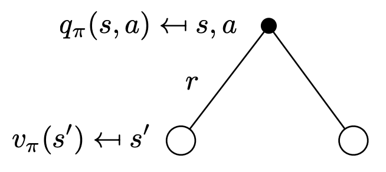
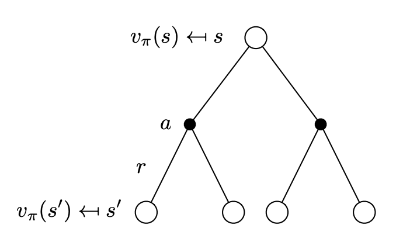

# 贝尔曼方程

**贝尔曼方程**（Bellman Equation）把值函数分解为了当前奖励（immediate reward）+ 未来奖励的折扣总和（discounted sum of future rewards）。

贝尔曼方程是一个递归的形式。

## 动作值函数的贝尔曼方程

::: tip 动作值函数的贝尔曼方程
$$
Q_{\pi}(s_t, a_t) = \mathbb{E}_{S_{t+1}, A_{t+1}} \Big [ R_t + \gamma \cdot Q_{\pi}(S_{t+1}, A_{t+1}) \mid S_t = s_t, A_t = a_t \Big ]
$$
:::

::: details 证明过程
易证：

$$
G_t = \sum_{k=0} \gamma^k R_{t+k} = R_t + \gamma \cdot G_{t+1}
$$

那么有：

$$
\begin{aligned}
  Q_{\pi}(s_t, a_t) &= \mathbb{E}_{S_{t+1}, A_{t+1}, \cdots} \Big [ G_t \mid S_t = s_t, A_t = a_t \Big ] \\
    &= \mathbb{E}_{S_{t+1}, A_{t+1}, \cdots} \Big [ R_t + \gamma \cdot G_{t+1} \mid S_t = s_t, A_t = a_t \Big ] \\
    &= \mathbb{E}_{S_{t+1}, A_{t+1}, \cdots} \Big [ R_t + \gamma \cdot Q_{\pi}(S_{t+1}, A_{t+1}) \mid S_t = s_t, A_t = a_t \Big ]
\end{aligned}
$$

最后一步是因为动作值函数 $Q_{\pi}(S_{t+1}, A_{t+1})$ 求的就是 $G_{t+1}$ 的期望。
:::

## 状态值函数的贝尔曼方程

::: tip 状态值函数的贝尔曼方程
$$
V_{\pi}(s_t) = \mathbb{E}_{A_t, S_{t+1}} \Big [ R_t + \gamma \cdot V_{\pi}(S_{t+1}) \mid S_t = s_t \Big ]
$$
:::

::: details 证明过程
由[状态值函数的定义](/ai/rl/basic/key-concepts.html#状态值函数)：$V_{\pi}(S_t) = \mathbb{E}_{A_t} \Big [ Q_{\pi}(S_t, A_t) \Big ]$ 得到：

$$
\begin{aligned}
  Q_{\pi}(S_t, A_t) &= \mathbb{E}_{S_{t+1}, A_{t+1}} \Big [ R_t + \gamma \cdot Q_{\pi}(S_{t+1}, A_{t+1}) \mid S_t = s_t, A_t = a_t \Big ] \\
    &= \mathbb{E}_{S_{t+1}} \Big [ R_t + \gamma \cdot V_{\pi}(S_{t+1}) \mid S_t = s_t, A_t = a_t \Big ]
\end{aligned}
$$

$$
\begin{aligned}
  V_{\pi}(S_t) &= \mathbb{E}_{A_t} \Big [ Q_{\pi}(S_t, A_t) \Big ] \\
    &= \mathbb{E}_{A_t, S_{t+1}} \Big [ R_t + \gamma \cdot V_{\pi}(S_{t+1}) \mid S_t = s_t \Big ]
\end{aligned}
$$
:::

## 另一种形式

贝尔曼方程可以表达为另一种形式。

$$
V_{\pi}(s) = \sum_{a \in \mathcal{A}} \pi(a \mid s) Q_{\pi}(s, a) \tag{1}
$$

---

$$
Q_{\pi}(s, a) = R(s, a) + \gamma \sum_{s' \in \mathcal{S}} P_{ss'}^a V_{\pi}(s') \tag{2}
$$

---

把式 (2) 代入式 (1)：

$$
V_{\pi}(s) = \sum_{a \in \mathcal{A}} \pi(a \mid s) \Big( R(s, a) + \gamma \sum_{s' \in \mathcal{S}} P_{ss'}^a V_{\pi}(s') \Big) \tag{3}
$$

---

把式 (1) 代入式 (2)：

$$
Q_{\pi}(s, a) = R(s, a) + \gamma \sum_{s' \in \mathcal{S}} P_{ss'}^a \sum_{a \in \mathcal{A}} \pi(a' \mid s') Q_{\pi}(s', a') \tag{4}
$$

---

式 (3) 和式 (4) 就是贝尔曼方程的另一种形式。

## 贝尔曼最优方程

[之前](/ai/rl/basic/key-concepts.html#动作值函数)定义了最优状态值函数 $V_*(s)$ 和最优动作值函数 $Q_*(s, a)$，如果只关注最优值：

$$
V_*(s) = \sum_{a \in \mathcal{A}} \pi(a \mid s) Q_*(s, a)
$$

$$
Q_*(s, a) = R(s, a) + \gamma \sum_{s' \in \mathcal{S}} P_{ss'}^a V_*(s')
$$

$$
V_*(s) = \sum_{a \in \mathcal{A}} \pi(a \mid s) \Big( R(s, a) + \gamma \sum_{s' \in \mathcal{S}} P_{ss'}^a V_*(s') \Big) \tag{5}
$$

$$
Q_*(s, a) = R(s, a) + \gamma \sum_{s' \in \mathcal{S}} P_{ss'}^a \sum_{a \in \mathcal{A}} \pi(a' \mid s') Q_*(s', a') \tag{6}
$$

式 (5) 和式 (6) 就是**贝尔曼最优方程**（Bellman Optimality Equation）。

## 总结

贝尔曼方程是大多数强化学习算法的理论基础。

可以看到，如果环境是已知的，即 $R(s, a)$ 和 $P_{ss'}^a$ 已知，这就变成了一个动态规划问题。但在很多问题中，我们并不知道这两个函数，所以不能直接通过贝尔曼方程来求解。
