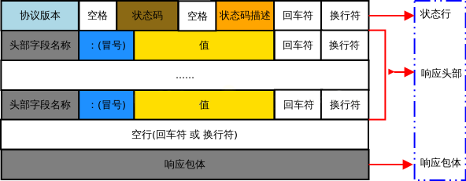

# 计算机网络

## TCP 协议

全称 Transmission Control Protocol（传输控制协议）。

- 传输层协议
- 是有状态的长连接
- 是面向连接的，通信开始前需要先建立连接，结束后要释放连接
- 每一条 TCP 连接只能有两个端点，每一条 TCP 连接只能是点对点的（一对一）
- 提供可靠交付的服务。通过 TCP 连接传送的数据，无差错、不丢失、不重复、并且按序到达
- 提供全双工通信，允许通信双方的应用进程在任何时候都能发送数据
- 面向字节流：应用程序和 TCP 的交互是一次一个数据块，但 TCP 把应用程序传下来的数据看成是一连串的无结构的字节流，接受后再把字节流组织成大小不等的数据块

### 各种术语

#### TCP 标志位

TCP 标志位代表了当前请求的目的，共有六种：

- **SYN（synchronous）**： 发送/同步标志，用来建立连接，和 ACK 标志位搭配使用。A 请求与 B 建立连接时，`SYN=1，ACK=0`；B 确认与 A 建立连接时，`SYN=1，ACK=1`
- **ACK（acknowledgement）**：确认标志。当 `ACK=1` 时确认号字段有效，否则无效。TCP 规定，在连接建立后所有传送的报文段都必须把 `ACK` 置 1。
- **FIN（finish）**：结束标志，用来关闭一个 TCP 连接。当 `FIN=1` 时，表示此报文段的发送方的数据已发送完毕，并要求关闭连接
- **PSH（push）**：表示推送操作，就是指数据包到达接收端以后，不对其进行队列处理，而是尽可能的将数据交给应用程序处理
- **RST（reset）**：重置复位标志，用于复位对应的 TCP 连接
- **URG（urgent）**：紧急标志，用于保证 TCP 连接不被中断，并且督促中间层设备尽快处理

#### 序列号（Sequence Number）

作用：记录发送数据包的顺序，接收方可以通过数据分段中的序列号来按照正常的顺序重组数据。

规则：

- 从初始序列号 `ISN`（Initial Sequence Number）开始
- 握手阶段，`[SYN]` 包即使没有传送数据，也会消耗一个序列号。因此，建立连接后的序列号从 `ISN+1` 开始
- 数据传输阶段，序列号 = 第一个报文段的序列号 + 已经发送的字节数
  - 比如第一个报文段的序列号为 301，携带的数据长度为 100 字节，则下一个报文段的序列号为 401
  - 如果某个报文段不携带数据，则不会消耗序列号，下一个报文段还是用相同的序列号发送
  - 正常情况下，B 给 A 的确认号，就是 A 下一个报文段的序列号  
- 挥手阶段，`[FIN/ACK]` 包即使没有传送数据，也会消耗掉一个序列号
- 客户端三次握手第三步的 `[ACK]` 包，和传输阶段的第一个报文段，有相同的序列号

#### 确认号（Acknowledge Number）

期望收到的下一个报文段的序列号。如 B 正确收到 A 发送来的一个报文段，序号为 501，携带的数据长度为 200 字节，因此 B 期望下一个报文段的序号为 701，B 发送给 A 的确认报文段中确认号就为 701。

在 `ACK` 置 1 时才有效。

#### MSL

全称 Maximum Segment Lifetime，可以译为“报文最大生存时间”，指任何报文在网络上能存在的最长时间（2 分钟），超过这个时间的报文将被丢弃。

### 连接过程（三次握手）

TCP 是面向连接的，无论哪一方向另一方发送数据之前，都必须先在双方之间建立一条连接。连接是通过三次握手进行初始化的，即在客户端和服务器之间交换三个 TCP 报文段。目的是同步连接双方的序列号和确认号并交换 TCP 窗口大小信息。

最初，客户端 A和服务器 B 都处于 CLOSED 状态。然后 A 主动打开连接，B 被动打开连接。

- 首先，B 处于 LISTEN 状态，等待客户端的连接请求

- **第一次握手**：建立连接。客户端发送**同步报文** `[SYN]`，`SYN = 1`，初始序列号 `seq = x`（`x` 是一个随机数）；然后，客户端进入 `SYN_SEND` 状态，等待服务器确认

  TCP 规定，`SYN = 1` 的报文段不能携带数据，但还是要消耗掉一个序列号

- **第二次握手**：服务器收到 `SYN` 报文段，如果同意建立连接，则向 A 发送**同步确认报文** `[SYN/ACK]`：`SYN = 1`，`ACK = 1`，确认号 `ack = x + 1`（`seq + 1`），同时设一个初始序列号 `seq = y`（`y` 是一个随机数）；然后服务器进入 `SYN_RECV` 状态

  这个报文段不能携带数据，但也还是要消耗掉一个序列号

- **第三次握手**：客户端收到服务器的确认后，置确认号 `ack = y + 1`，序号 `seq = x + 1`，`ACK = 1`，然后把这个**确认报文** `[ACK]` 发给服务器。之后，客户端和服务器端都进入 `ESTABLISHED` 状态

  确认报文段可以携带数据。但如果不携带数据则不消耗序列号，这种情况下，下一个报文段的序号仍是 `seq = x + 1`

### 为什么要三次握手

#### 为什么不两次

防止已失效的连接请求突然又到达了服务器，让服务器错误建立连接。

:::tip 举个栗子
A 发出的一个连接请求报文段长时间滞留，以致于延误到连接释放以后的某个时间段才到达 B。B 收到这个失效的链接请求报文段后，误以为 A 又发出一次新的连接请求。于是就向 A 发出确认报文段，同意建立连接。

如果不进行第三次握手，B 发出确认报文后就认为新的连接已经建立了，并一直等待 A 发来数据，于是 B 的许多资源就这样白白浪费了。如果采用了三次握手，由于 A 实际上并没有发出建立连接请求，所以不会理 B 的确认，也不会向 B 发送数据。B 由于收不到确认，就知道 A 并没有要求建立连接。
:::

#### 为什么不四次或更多

四次或更多的通信次数也可以达到目的，但三次是建立连接所需要的最小次数：

- 第一次握手：服务器确认“服务器收、客户端发”正常
- 第二次握手：客户端确认“客户端发、客户端收、服务器收、服务器发”正常，客户端认为连接已建立
- 第三次握手：服务器确认“服务器发、客户端收”正常，此时双方均建立连接，可以正常通信

的确，A 发出 `[ACK]` 报文后（第三次）在没有收到 B 的确认的情况下就已经进入了连接状态，那如果这个 `[ACK]` 报文丢失或滞留了，也还是会出问题。但完全可靠的通信协议是不存在的。在经过三次握手之后，客户端和服务器已经可以确认双方的通信状况，即便再增加握手次数也不能保证后面的通信完全可靠，所以是没有必要的。

### 断开链接（四次挥手）

数据传输完毕后，需要释放 TCP 连接（通信双方都可以释放连接）。

- **第一次挥手**：A 发出**连接释放报文** `[FIN/ACK]`：`FIN = 1`，`ACK = 1`，`seq = u`（= A 上次发送的报文的最后一个字节的序列号 + 1）；然后停止再发送数据，进入 `FIN-WAIT-1` 状态，等待 B 的确认

  TCP 规定，`FIN = 1` 的报文段即使不携带数据，也将消耗掉一个序列号

- **第二次挥手**：B 收到 A 的连接释放报文后，发出**确认报文** `[ACK]`：`ACK = 1`，`seq = k`（= 即 B 上次发送的报文的最后一个字节的序号 + 1），`ack = u + 1`；然后 B 进入 `CLOSE-WAIT` 状态

  这时的 TCP 连接处于半关闭状态，即 A 已经没有数据要发送了，A 到 B 的连接释放了，但 B 到 A 的连接还没有释放，B 可能还有数据要发，这个状态可能会持续一段时间。
  
  **所以第二次跟第三次挥手不能合并**
  
  A 收到来自 B 的确认后，进入 `FIN-WAIT-2` 状态，等待 B 发出的连接释放报文

- **第三次挥手**：B 发出**连接释放报文** `[FIN/ACK]`：`FIN = 1`，`seq = w`（= 即 B 上次发送的报文的最后一个字节的序号 + 1，如果半关闭状态时，服务端没有发送数据，则 `w = k`）；然后停止再发送数据，进入 `LAS_ACK` 状态，等待 A 的确认

  同样，这个报文即使不携带数据，依然还是要消耗掉一个序列号

- **第四次挥手**：A 收到 B 的连接释放报文后，发出**确认报文** `[ACK]`：`ACK = 1`，`seq = u + 1`（与第二次挥手相同，因为这段时间 A 没有发送数据），`ack = w + 1`

- 然后 A 进入 `TIME-WAIT` 状态，经过 2 * [MSL](#msl)（2 * 2min = 4min）的时间后，A 进入 `CLOSED` 状态。而 B 只要收到 A 发出的确认，就立即进入 `CLOSED` 状态。所以 B 结束 TCP 连接的时间要早于 A

### 为什么要 TIME-WAIT

- 第四次挥手时，A 发送的最后一个确认报文 `[ACK]` 不一定能到达 B，这是 B 会超时重传连接释放报文 `[FIN/ACK]`，此时如果 A 已经断开了连接，就无法响应 B 的二次请求，这样 B 迟迟收不到确认报文，就无法正常断开连接。

  2MSL = A 的 `[ACK]` 报文 1MSL 超时 + B 的 `[FIN/ACK]` 报文 1MSL 传输

- TCP 要求在 2MSL 内不使用相同的序列号。A 在发送完最后一个 `[ACK]` 报文后，再经过时间 2MSL，就可以保证本连接持续的时间内产生的所有报文都从网络中消失。这样就可以使下一个连接中不会出现这种旧的连接请求报文段，或者即使收到这些过时的报文，也可以不处理它。

### 为什么要四次挥手

TCP 是全双工的，一方关闭连接后，另一方还可以继续发送数据。所以四次挥手，将断开连接分成两个独立的过程。

## HTTP 协议

全称 HyperText Transfer Protocol（超文本传输协议）。超文本指带标记的文本，刚开始指 HTML，现在表单、JSON、XML、文件什么的都可以传。

应用层协议，通过 TCP 协议发送数据。

### HTTP 请求方法

请求方法表明了要对给定资源执行的操作，每一个请求方法都实现了不同的语义。

- **GET**：获取服务器的指定资源
- **POST**：提交资源到服务器 / 在服务器新建资源
- **HEAD**：和 GET 一样，都是获取服务器指定资源的请求。不同的是服务器只会返回 Header 而不会返回 Body，常用于确认 URI 的有效性及资源更新的日期时间等。典型应用：下载文件时，先通过 HEAD 方法获取 Header，从中读取文件大小 `Content-Length`，然后再配合 `Range` 字段分片下载服务器资源
- **PUT**：替换整个目标资源。由于自身不带验证机制，任何人都可以上传文件，因此存在安全性问题，一般不使用该方法
- **PATCH**：替换目标资源的部分内容
- **DELETE**：删除指定的资源。与 PUT 功能相反，并且同样不带验证机制
- **OPTIONS**：查询指定的 URL 能够支持的方法，会返回类似于 `Allow: GET, POST, HEAD, OPTIONS` 的内容
- **CONNECT**
- **TRACE**

**幂等的**：幂等的 HTTP 方法，指同样的请求执行一次与执行多次的效果是一样的，即没有副作用

- 常见的幂等方法：GET、HEAD、PUT、DELETE、OPTIONS
- 常见的非幂等方法：POST

**安全的**：安全的 HTTP 方法，指该方法对服务器进行只读操作，不会修改服务器数据

- 常见的安全方法：GET、HEAD、OPTIONS
- 常见的不安全方法：PUT、DELETE、POST

所有安全的方法都是幂等的。有些不安全的方法如 DELETE 是幂等的（而 PUT 和 DELETE 则不是）

**可缓存的**：GET、HEAD

### GET 和 POST 区别

大部分是从[这里](https://imageslr.com/2020/http.html#get-和-post-的区别)抄过来的。

|        | GET                          | POST                          |
| ------ | ---------------------------- | ----------------------------- |
| 应用    | 获取服务器的指定数据            | 添加 / 修改服务器的数据           |
| 历史记录 / 书签 | 可保留在浏览器历史记录中或收藏为书签 |  不可以                |
| 缓存    | 会被浏览器主动缓存           | 不会，除非手动设置                |
| 幂等    | 幂等，不会改变服务器上的资源     | 非幂等，会改变服务器资源           |
| 后退 / 刷新 | 后退或刷新时，GET 是无害的    | 后退或刷新时，POST 会重新提交表单  |
| 参数位置 | query 中（直接明文暴露在链接中） | query 或 body 中               |
| 参数类型 | ASCII 字符                   | 无限制                          |
| 参数长度 | 有限制（被浏览器和服务器限制）   | 无限制                          |

### 为什么 GET 请求传参长度有限制

HTTP 协议并没有限制 GET / POST 的请求长度。这个限制来源与浏览器或 WEB 服务器，浏览器或 WEB 服务器限制了 URI 的长度。

不同的浏览器和 WEB 服务器限制的最大长度不一样。如果要支持 IE，则最大长度为 2083 字节，如果只支持 Chrome，则最大长度为 8182 字节。

### HTTP 状态码

[MDN：HTTP 响应代码](https://developer.mozilla.org/zh-CN/docs/Web/HTTP/Status)

#### 信息响应（100 - 199）

| 状态码 | 名称                 |  描述                                 |
| ----- | ------------------- | ------------------------------------- |
| 100   | Continue / 继续      | 到目前为止都很正常，客户端可以继续其请求     |
| 101   | Switching Protocols / 切换协议 | 服务器根据客户端的请求切换协议，只能切换到更高级的协议（如，切换到 HTTP 的新版本协议） |

#### 成功响应（200 – 299）

| 状态码 | 名称                 |  描述                                 |
| ----- | ------------------- | ------------------------------------- |
| 200   | OK / 请求成功         | 通常用于 GET 与 POST 请求               |
| 201   | Created / 已创建     | 该请求已成功，并因此创建了一个新的资源。通常是在 POST 请求后返回的响应 |
| 202   | Accepted / 已接受    | 已接受请求，但还未处理完成                 |
| 204   | No Content / 无内容  | 请求已被服务器成功处理，但拒绝对 GET / POST 请求的内容进行返回，即返回的响应报文不包含实体的主体部分。通常用于只需要从客户端往服务器发送信息，而不需要返回数据时 |
| 206   | Partial Content / 部分内容 | 服务器成功处理了部分 GET 请求。该请求必须包含 `Range` 头信息来指示客户端希望得到的内容范围。通常用于实现断点续传，或者将一个大文档分为多个片段然后并行下载 |

#### 重定向（300 – 399）

- **301、302、307 重定向原理**
  - **定义**：服务器给浏览器返回一个状态码为 301 或 302 的重定向响应，将旧地址重定向到一个新的地址。浏览器会自动跳转到 Location 域指明的 URL，需要的所有信息都在 HTTP 头部，而响应体一般是空的。
  - **目的**：如果一个页面有两个地址，搜索引擎会认为他们是两个网站，导致每个地址的链接成绩都减少，从而降低排名。而 301 重定向会让搜索引擎把两个地址归到同一个网站的排名下，从而不影响网站的排名。
- **304 缓存机制**：见 [HTTP 缓存](#http-缓存)

| 状态码 | 名称                 |  描述                                 |
| ----- | ------------------- | ------------------------------------- |
| 301   | Moved Permanently / 永久移动 | 永久重定向。旧地址的资源已被永久移除移动到新地址，今后任何新的请求都应使用新的地址代替。常见场景：永久更换网站地址或域名 |
| 302   | Found / 临时移动      | 临时重定向。资源只是临时被移动，这个重定向只是临时从旧地址跳转到新地址，客户端应继续向旧地址发送以后的请求。常见场景：网站临时换地址、将所有 HTTP 流量重定向到 HTTPS |
| 303   | See Other / 查看其它地址 | 与 301 类似，但要求客户端应使用 GET 方法获取资源 |
| 304   | Not Modified / 未修改 | 所请求的资源未修改。客户端发送了一个带条件的 GET 请求（客户端通常会缓存访问过的资源，通过提供一个头信息指出客户端希望只返回在指定日期之后修改的资源）且该请求已被允许，而文档的内容（自上次访问以来或者根据请求的条件）并没有改变，则服务器返回此状态码。304 响应不含消息体，即不会返回任何资源，因此始终以消息头后的第一个空行结尾 |
| 305   | Use Proxy / 使用代理   | 被请求的资源必须通过指定的代理才能被访问             |
| 307   | Temporary Redirect / 临时重定向 | 与 302 类似，但要求客户端使用 GET 方法获取资源 |

#### 客户端错误（400 – 499）

| 状态码 | 名称                 |  描述                                 |
| ----- | ------------------- | ------------------------------------- |
| 400   | Bad Request         | 客户端请求的语义有误，无法被服务器理解 / 请求参数有误 |
| 401   | Unauthorized        | 当前请求需要用户的身份认证                |
| 403   | Forbidden           | 服务器已经理解请求客户端的请求，但是拒绝执行它。与 401 不同的是，提供了身份验证也没有用。比如你的 IP 被服务器拉黑了 |
| 404   | Not Found           | 服务器无法找到客户端请求的资源，并且不知道这是否是永久的。如果服务器能够确定这是永久的，应使用 410 状态码 |
| 408   | Request Time-out / 请求超时 | 服务器等待客户端发送的请求时间过长，超时    |
| 410   | Gone                | 客户端请求的资源在服务器上已经不再可用，而且没有任何已知的转发地址。不同于 404，410 用于服务器端知道客户端所请求的资源曾经存在，但现在已经永久不存在了的情况 |

#### 服务器错误 （500 – 599）

| 状态码 | 名称                 |  描述                                 |
| ----- | ------------------- | ------------------------------------- |
| 500   | Internal Server Error / 服务器内部错误| 服务器遇到了不知道如何处理的情况 |
| 501   | Not Implemented     | 服务器不支持请求方法。只有 GET 和 HEAD 是要求服务器支持的，它们一定不会返回 501 |
| 502   | Bad Gateway / 网关错误 | 作为网关或者工作的服务器尝需要从上游服务器（如 tomcat、php-fpm）得到一个处理这个请求的响应，但收到的响应是无效的 |
| 503   | Service Unavailable | 服务器暂时的无法处理客户端的请求，常见原因是服务器因为超载或系统维护而停机 |

### HTTP 首部

有 4 种类型的首部字段：通用首部字段、请求首部字段、响应首部字段和实体首部字段，各种首部字段及其含义见[这里](https://github.com/CyC2018/CS-Notes/blob/master/notes/HTTP.md#四http-首部)。

### HTTP 报文结构

#### 请求报文

HTTP 请求报文由请求行（request line）、请求头部（header）、空行和请求数据 4 个部分组成：

##### 请求行

分为三个部分：请求方法、请求地址和协议版本：

  - [**请求方法**](#http-请求方法)：最常的是 GET 和 POST

  - **请求地址**（URL，统一资源定位符）：一种自愿位置的抽象唯一识别方法
  
    组成：`<协议>://<主机>:<端口>/<路径>`，端口和路径有时可以省略（HTTP 默认端口号是 80）

    有时会带参数：`<协议>://<主机>:<端口>/<路径>?key1=value1&key2=value2`

  - **协议版本**：格式为 `HTTP/主版本号.次版本号`，常用的有 HTTP/1.0 和 HTTP/1.1

##### 请求头

[MDN: HTTP Headers](https://developer.mozilla.org/zh-CN/docs/Web/HTTP/Headers)

请求头为请求报文添加了一些附加信息。一个请求头由名称（不区分大小写）后跟一个冒号 `:`，冒号后跟具体的值（不带换行符）组成，值前面的引导空白会被忽略。

请求头必不可少。

常见的请求头字段名：

| 字段名            | 说明                                               |
| ---------------- | -------------------------------------------------  |
| Host             | 接受请求的服务器地址，可以是 `IP:端口号`，也可以是域名     |
| User-Agent       | 发送请求的应用程序名称                                |
| Connection       | 指定与连接相关的属性，如 `Connection:Keep-Alive`       |
| Accept-Charset   | 客户端支持的字符集                                    |
| Accept-Encoding  | 客户端支持的压缩方法                                  |
| Accept-Language  | 客户端期望的页面语言                                  |

##### 空行

请求头的最后会有一个空行，表示请求头结束，接下来为请求数据。

##### 请求数据

可选，比如 GET 请求就没有请求数据。

#### 响应报文

HTTP 响应报文主要由状态行、响应头部、空行以及响应数据组成。

##### 状态行

分为三个部分：协议版本，状态码，状态码描述。协议版本与请求报文一致，状态码见[上一节](#http-状态码)，状态码描述是对状态码的简单描述。

##### 响应头部

与请求头部类似，为响应报文添加了一些附加信息。常见的响应头字段名：

| 字段名            | 说明                                               |
| ---------------- | -------------------------------------------------  |
| Server           | 服务器应用程序软件的名称和版本                         |
| Content-Type     | 响应正文的媒体类型                                   |
| Content-Encoding | 响应正文的编码方式                                   |
| Content-Language | 响应正文所使用的语言                                  |

##### 空行

和请求头一样，响应头的最后会有一个空行，表示响应头结束，接下来为响应数据。

##### 响应数据

用于存放需要返回给客户端的数据。

### HTTP 1.0/2.0/3.0

- [HTTP/1.0、HTTP/1.1、HTTP/2.0 的变化](https://imageslr.com/2020/http.html#http10http11http20-的变化)
- [HTTP/2 对比 HTTP/1.1，特性是什么？是如何解决队头阻塞与压缩头部的？](https://github.com/Advanced-Frontend/Daily-Interview-Question/issues/490)
- [HTTP/3 新特性，为什么选择使用 UDP 协议？](https://github.com/Advanced-Frontend/Daily-Interview-Question/issues/492)

### 为什么 HTTP/1.1 不能实现多路复用

HTTP/2.0 将数据块分成了帧（frame），把帧以数据流（stream）的形式发送。每个帧会有一个该帧属于哪个流的标识，接收端在收到后可以将这些帧重新组装成数据块，从而在一个 TCP 连接中可以存在多条流。

而 HTTP/1.1 不是二进制传输，而是通过文本进行传输，也没有“流”的概念。如果使用多路复用传输数据，接收端在收到响应后，并不能区分多个响应分别对应的请求，所以无法将多个响应的结果重新进行组装，也就实现不了多路复用。

### HTTP 缓存

- [Http 缓存策略，有什么区别，分别解决了什么问题](https://github.com/lgwebdream/FE-Interview/issues/14)
